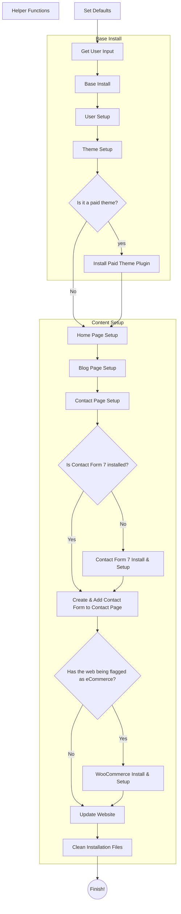

# WPCLI WordPress Generator

This repo aims at ease you build your own WP-CLI-based WordPress Generator Script. Hope it helps

## How To Use It -in a nutshell-

## Table of Contents

- [WPCLI WordPress Generator](#wpcli-wordpress-generator)
  - [How To Use It -in a nutshell-](#how-to-use-it--in-a-nutshell-)
  - [Table of Contents](#table-of-contents)
  - [Intro](#intro)
  - [How it works](#how-it-works)
    - [Code Structure](#code-structure)
    - [Helper Functions](#helper-functions)
      - [generate_db_prefix](#generate_db_prefix)
        - [generate_db_prefix usage](#generate_db_prefix-usage)
      - [generate_pass](#generate_pass)
        - [generate_pass usage](#generate_pass-usage)
      - [get_domain](#get_domain)
        - [get_domain usage](#get_domain-usage)
      - [slugify](#slugify)
        - [slugify usage](#slugify-usage)
  - [How to modify this project](#how-to-modify-this-project)
    - [Defaults](#defaults)
    - [Features](#features)
      - [Question: How can I add a new locale?](#question-how-can-i-add-a-new-locale)
      - [Question: How can I add a new menu?](#question-how-can-i-add-a-new-menu)
      - [Question: How can I add a new page?](#question-how-can-i-add-a-new-page)
      - [Question: How can I add a new plugin?](#question-how-can-i-add-a-new-plugin)
      - [Question: How can I add a new paid plugin?](#question-how-can-i-add-a-new-paid-plugin)
      - [Question: How can I add a new widget?](#question-how-can-i-add-a-new-widget)
    - [Themes](#themes)
      - [Question: How can I add a new theme?](#question-how-can-i-add-a-new-theme)
      - [Question: How can I add a new paid theme?](#question-how-can-i-add-a-new-paid-theme)
      - [Question: How can I setup a new theme?](#question-how-can-i-setup-a-new-theme)
    - [Wanna know anything more?](#wanna-know-anything-more)
  - [TODO](#todo)
  - [Technologies](#technologies)
  - [Sources](#sources)
  - [Status](#status)

## Intro

If you've build several websites using WordPress, you'd know by now most of those projects are -basically- the same project. You just need to change contents, colors and images.

So... you're doing the same actions everytime you build a website:

1. Install&Setup WordPress
2. Install&Setup a WordPress Theme
3. Install&Setup Features -which fall into one of the following three categories-:
   1. Common-to-all-projects Features:
      1. Plugins: Forms Plugin, Cookies Plugin -at least in Europe-, WPO Plugin -e.g. WP Rocket-, ...
      2. Pages: homepage, blog page, contact page, legal pages -legal notice, privacy policy, cookies policy, ...
      3. Menus: main menu -usually a the top of the page-, footer / legal menu, ...
   2. Common-to-a-project-category Features:
      1. eCommerce: e.g. WooCommerce -plugin-, utc page, profile page, account menu, ...
      2. membership site: e.g. MemberPress -plugin-, profile page, account menu, ...
      3. educational: e.g. LearnDash, courses page, subject page, profile page, account menu, ...
   3. Project-specific Features:
      1. any plugin you need for a specific feature, e.g. Flamingo -to save all Contact Form 7 submits in the WordPress database,...
      2. any page: e.g. team page, ...
4. Project-specific customizations -made in the `functions.php` file.

You can see you are repeating from point 1 to point 3.2.1 for each and every project you build. How much time -and money- does it cost to you? On average, that part of the setup takes 2 to 4 hours.

And what about point 3.2.2. -which you're doing every time you build a category-specific project?

Wouldn't it be great if you could automate all that work and focus on what truly adds value to a project?

I hope this repo helps you to write a script that automates anything common to your projects. I made it as generic as possible so you have a good base to begin with and I'm trying to add as much info as I can so you can modify it to build your own customized script.

Feel free to contact me to ask for help. I won't answer for theme or plugin specific setups -too many themes and plugins out there- but I'm open to help with anything else -e.g. how can you get info about plugins, pages, ... to make your own modifications-.

Just make sure you read the [How to modify this project](#how-to-modify-this-project) section before as any question I've been asked is answered there.

## How it works

### Code Structure

### Helper Functions

#### generate_db_prefix

`generate_db_prefix` has all the code needed to generate a secure DB_PREFIX. Though it's only used once in every project, I thought it will be easier to improve and maintain the code by being in a function.

The function provides 2 ways to generate a DB_PREFIX:

1. A completetly random DB_PREFIX,
2. A seed-based DB_PREFIX

##### generate_db_prefix usage

Without seed:

`DB_PREFIX=$(generate_db_prefix)`

With seed:

`DB_PREFIX=$(generate_db_prefix $SEED)`

#### generate_pass

`generate_pass` has all the code needed to generate a secure password. Though it's only used once in every project, I thought it will be easier to improve and maintain the code by being in a function.

**As the code of this function it's been published as an example, you MUST change it to match your needs.**

##### generate_pass usage

`PASSWORD=$(generate_pass $SEED)`

#### get_domain

For me, the DOMAIN it's the real project name and matches the first part of the website's url -which is the domain without the TLD or the subdomain if the URL has one.

`get_domain` has all the code needed to get the domain from the URL. We're going to use several times during the installation.

##### get_domain usage

`DOMAIN=$(get_domain $URL)`

#### slugify

WordPress uses both regular names and slugs to identify several objects -such as users or pages-. Generally, the same creation process of this objects handle the needed slugificacion.

For those cases we need to handle ourselves, I've written this function.

##### slugify usage

`SLUG=$(slugify ${THE_NAME_TO_BE_SLUGIFIED// /})`

Please, note we substitute spaces before passing THE_NAME_TO_BE_SLUGIFIED so the function has no problem getting all the name as one parameter.

## How to modify this project

### Defaults

After the "Helper Functions" Section in the script, you'll see a "Defaults" Section where I've set all the defaults you're going to always use in your projects without modifications.

You'll see the following defaults:

1. `REPO`: as I want this script to be as maintainable as possible, I've let some setups in other files. You can copy all of them every time or you can upload them to your own server and setup de url here so you only need to copy the main file.
   1. Moreover, in case you're going to install any paid theme / plugin, you're gonna need to have it in an open url to easily use it from the script.
2. `DBHOST`: usually, all databases are in 'localhost' but if it's not your case, you can setup the basic host here.
3. Default Setup Data:
   1. `LOCALE`: as this is a generic script, I've used 'en_US' as locale but as I'm spanish and most of my projects are in Spanish I have this setup to 'es_ES'. Moreover, as I usually work in Valencia I also use the catalonian locale -'ca'-.
   2. `DATE_FORMAT`: as this is a generic script, I've used 'm/d/Y' as date format but as I'm spanish and most of my projects are in Spanish I have this setup to 'd/m/Y'.
   3. `TIME_FORMAT`: as this is a generic script, I've used 'g:i a' as date format but as I'm spanish and most of my projects are in Spanish I have this setup to 'H:i'.
   4. `TIMEZONE_STRING`: as this is a generic script, I've used 'America/New_York' as date format but as I'm spanish and most of my projects are in Spanish I have this setup to 'Europe/Madrid'.
4. Default Users: as this script it's aimed at easing development tasks I usually create an admin user for myself and the tasks I have to do. This is also useful whenever I need to do some maintenance for the client. If you don't want to setup your own user, you just need to set this vars as empty.
   1. `OUR_ADMIN_EMAIL`: My user's email. This is a required field.
   2. `OUR_ADMIN_FIRST_NAME`: My user's first name.
   3. `OUR_ADMIN_LAST_NAME`: My user's first name.
   4. `OUR_ADMIN_DISPLAY_NAME`: My user's display name.
   5. `OUR_ADMIN_URL`: My user's website.
   6. `OUR_ADMIN_USER`: My user's login. This is a required field. In this case, I generate it from the display name -which is also generated from first and last name-.
5. Default colors: As I think this is key in a development process I've created this set of vars.
   1. Brand colors: generally we use two sets of brand colors -each one with a background and a foreground / text color-:
      1. Primary colors:
         1. `PRIMARY_BG_COLOR`
         2. `PRIMARY_FG_COLOR`
      2. Secondary / accent colors:
         1. `ACCENT_BG_COLOR`
         2. `ACCENT_FG_COLOR`
   2. Message colors: Every web / app uses messages to notify the user how are the results of her actions. Here you can setup all of them:
      1. Info messages:
         1. `INFO_BG_COLOR`
         2. `INFO_FG_COLOR`
      1. Success messages:
         1. `SUCCESS_BG_COLOR`
         2. `SUCCESS_FG_COLOR`
      1. Warning messages:
         1. `WARNING_BG_COLOR`
         2. `WARNING_FG_COLOR`
      1. Danger messages:
         1. `DANGER_BG_COLOR`
         2. `DANGER_FG_COLOR`

### Features

#### Question: How can I add a new locale?

#### Question: How can I add a new menu?

#### Question: How can I add a new page?

#### Question: How can I add a new plugin?

#### Question: How can I add a new paid plugin?

#### Question: How can I add a new widget?

### Themes

#### Question: How can I add a new theme?

I've set theme [Twenty Twenty Two][twentytwentytwo] as the default theme 'cause it's the default theme this year and has the basics of theme setup.

If you want to use another theme you just need to:

1. copy the `twentytwentytwo` folder
2. change its name to the theme name you want to setup
3. modify the `PARENT_THEME` var to match the theme name you want to setup
4. update the theme's setup to your needs as explained here.

#### Question: How can I add a new paid theme?

I've set theme [Twenty Twenty Two][twentytwentytwo] as the default theme 'cause it's the default theme this year and has the basics of theme setup.

However in this case it's not as straightforward as with a free theme. Most paid themes are a mix of:

1. a free theme
2. a paid extension theme plugin

E.g. GeneratePress has:

1. a free theme called [GeneratePress][generatepress]
2. a paid extension theme plugin called [GP Premium][gp-premium]

You can get the free theme and use it the same way I told you in the [previous question](#question-how-can-i-add-a-new-theme) but you'll need some modifications for the paid extension plugin:

1. copy the `twentytwentytwo` folder
2. change its name to the theme name you want to setup
3. modify the `PARENT_THEME` var to match the theme name you want to setup
4. some paid themes have their own child theme, if that's the case then:
   1. get the child theme
   2. remove the version string from the zip file name
   3. upload it to your private open repo -which you have set up with the `REPO` var explained in the "[Defaults Section](#defaults)"- into the `themes/parent_theme/` folder
   4. add the following line instead of the `wp scaffold child-theme` line in the `install.sh` file inside the `themes/parent_theme/` folder -don't forget to change "ZIP-WITH-THE-CHILD-THEME" with the actual zip file name:
      1. wp theme install "${REPO}/themes/${PARENT_THEME}/ZIP-WITH-THE-CHILD-THEME" --activate
5. now you have to setup the paid extension theme plugin:
   1. get the paid extension theme plugin
   2. remove the version string from the zip file name
   3. upload it to your private open repo -which you have set up with the `REPO` var explained in the "[Defaults Section](#defaults)"- into the `themes/parent_theme/` folder
   4. add the following line to after the `wp theme install "${REPO}/themes/${PARENT_THEME}/ZIP-WITH-THE-CHILD-THEME" --activate` line the `install.sh` file inside the `themes/parent_theme/` folder -don't forget to change "ZIP-WITH-THE-PLUGIN" with the actual zip file name:
      1. wp plugin install "${REPO}/themes/${PARENT_THEME}/ZIP-WITH-THE-PLUGIN" --activate
6. update the theme's setup to your needs as explained here.

#### Question: How can I setup a new theme?

Theme config is saved in the options table so if you want to know want config can you do you'll need to:

1. install the theme you want
2. setup the theme to match your requirements
3. access with SSH to the server
4. look at the theme's config options with the following commands:
   1. `wp option list --search="*${PARENT_THEME}*" --field=option_name`
   2. `wp option list --search="*${CHILD_THEME}*" --field=option_name`

You'll need some tinkering to get the correct setup and then update the theme install file with it.

I've set an example at the Twenty Twenty Two folder.

### Wanna know anything more?

I'm no to going to answer questions about specific setups -such as "how can I setup plugin X?"- as this repo it's not aimed at giving customized solutions but to encourage you to create your own.

On the other hand, I'll try to answer any question it's not already answered in this section.

## TODO

1. Add code to setup basic colors from user input.

## Technologies

WPCLI WordPress Generator has been developed with:

- Shellscript
- [WP CLI][wpcli]

## Sources

## Status

This project has been tested up to WordPress 6 and PHP 8.

Created by [@borjalofe][github].

[generatepress]: https://wordpress.org/themes/generatepress/
[gp-premium]: https://generatepress.com/premium/
[github]: https://github.com/borjalofe/
[wpcli]: https://make.wordpress.org/cli/
[twentytwentytwo]: https://wordpress.org/themes/twentytwentytwo/
