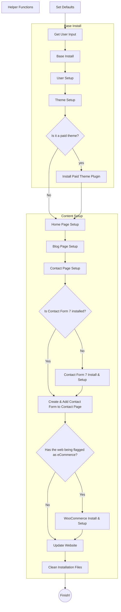

# WPCLI WordPress Generator

This repo aims at ease you build your own WP-CLI-based WordPress Generator Script. Hope it helps

## How To Use It -in a nutshell-

## Table of Contents

- [WPCLI WordPress Generator](#wpcli-wordpress-generator)
  - [How To Use It -in a nutshell-](#how-to-use-it--in-a-nutshell-)
  - [Table of Contents](#table-of-contents)
  - [Intro](#intro)
  - [How it works](#how-it-works)
    - [Code Structure](#code-structure)
    - [Helper Functions](#helper-functions)
      - [generate_db_prefix](#generate_db_prefix)
        - [generate_db_prefix usage](#generate_db_prefix-usage)
      - [generate_pass](#generate_pass)
        - [generate_pass usage](#generate_pass-usage)
      - [get_domain](#get_domain)
        - [get_domain usage](#get_domain-usage)
      - [slugify](#slugify)
        - [slugify usage](#slugify-usage)
  - [Modify this project](#modify-this-project)
    - [Add a new theme](#add-a-new-theme)
      - [Paid themes](#paid-themes)
    - [Add a new plugin](#add-a-new-plugin)
      - [Paid plugins](#paid-plugins)
    - [Add a new page](#add-a-new-page)
    - [Add a new menu](#add-a-new-menu)
    - [Add a new widget](#add-a-new-widget)
    - [Wanna know anything more?](#wanna-know-anything-more)
  - [Technologies](#technologies)
  - [Sources](#sources)
  - [Status](#status)

## Intro

## How it works

### Code Structure

### Helper Functions

#### generate_db_prefix

`generate_db_prefix` has all the code needed to generate a secure DB_PREFIX. Though it's only used once in every project, I thought it will be easier to improve and maintain the code by being in a function.

The function provides 2 ways to generate a DB_PREFIX:

1. A completetly random DB_PREFIX,
2. A seed-based DB_PREFIX

##### generate_db_prefix usage

Without seed:

`DB_PREFIX=$(generate_db_prefix)`

With seed:

`DB_PREFIX=$(generate_db_prefix $SEED)`

#### generate_pass

`generate_pass` has all the code needed to generate a secure password. Though it's only used once in every project, I thought it will be easier to improve and maintain the code by being in a function.

**As the code of this function it's been published as an example, you MUST change it to match your needs.**

##### generate_pass usage

`PASSWORD=$(generate_pass $SEED)`

#### get_domain

For me, the DOMAIN it's the real project name and matches the first part of the website's url -which is the domain without the TLD or the subdomain if the URL has one.

`get_domain` has all the code needed to get the domain from the URL. We're going to use several times during the installation.

##### get_domain usage

`DOMAIN=$(get_domain $URL)`

#### slugify

WordPress uses both regular names and slugs to identify several objects -such as users or pages-. Generally, the same creation process of this objects handle the needed slugificacion.

For those cases we need to handle ourselves, I've written this function.

##### slugify usage

`SLUG=$(slugify ${THE_NAME_TO_BE_SLUGIFIED// /})`

Please, note we substitute spaces before passing THE_NAME_TO_BE_SLUGIFIED so the function has no problem getting all the name as one parameter.

## Modify this project

### Add a new theme

#### Paid themes

### Add a new plugin

#### Paid plugins

### Add a new page

### Add a new menu

### Add a new widget

### Wanna know anything more?

I'm no to going to answer questions about specific setups -such as "how can I setup plugin X?"- as this repo it's not aimed at giving customized solutions but to encourage you to create your own.

On the other hand, I'll try to anwser any question it's not already answered in this section.

## Technologies

WPCLI WordPress Generator has been developed with:

- Shellscript
- [WP CLI][wpcli]

## Sources

## Status

This project has been tested up to WordPress 6 and PHP 8.

Created by [@borjalofe][github].

[github]: https://github.com/borjalofe/
[wpcli]: https://make.wordpress.org/cli/
