# WPCLI WordPress Generator

This repo aims at ease you build your own WP-CLI-based WordPress Generator Script. Hope it helps

## How To Use It -in a nutshell-

## Table of Contents

- [WPCLI WordPress Generator](#wpcli-wordpress-generator)
  - [How To Use It -in a nutshell-](#how-to-use-it--in-a-nutshell-)
  - [Table of Contents](#table-of-contents)
  - [Intro](#intro)
  - [How it works](#how-it-works)
  - [Modify this project](#modify-this-project)
    - [Add a new theme](#add-a-new-theme)
      - [Paid themes](#paid-themes)
    - [Add a new plugin](#add-a-new-plugin)
      - [Paid plugins](#paid-plugins)
    - [Add a new page](#add-a-new-page)
    - [Add a new menu](#add-a-new-menu)
    - [Add a new widget](#add-a-new-widget)
  - [Technologies](#technologies)
  - [Sources](#sources)
  - [Status](#status)

## Intro

## How it works

```mermaid
    flowchart LR
        A[Set Defaults] --> B[Get User Input]
        subgraph base [Base Install]
            direction TB
            B -->C[Base Install]
            C --> D[User Setup]
            D --> E[Theme Setup]
            E --> F{Is it a paid theme?}
            F -->|yes| G[Install Paid Theme Plugin]
        end
        subgraph content [Content Setup]
            direction TB
            F ---->|No| H[Home Page Setup]
            G --> H
            H --> I[Blog Page Setup]
            I --> J[Contact Page Setup]
            J --> K{Is Contact Form 7 installed?}
            K -->|No| L[Contact Form 7 Install & Setup]
            K ---->|Yes| M[Create & Add Contact Form to Contact Page]
            L --> M
            M --> N{Has the web being flagged as eCommerce?}
            N -->|Yes| O[WooCommerce Install & Setup]
        end
        subgraph content [Ending Tasks]
            direction TB
            N ---->|No| P[Update Website]
            O --> P
            P --> Q[Clean Installation Files]
        end
        Q --> R((Finish!))
```

## Modify this project

### Add a new theme

#### Paid themes

### Add a new plugin

#### Paid plugins

### Add a new page

### Add a new menu

### Add a new widget

## Technologies

WPCLI WordPress Generator has been developed with:

- Shellscript
- [WP CLI][wpcli]

## Sources

## Status

This project has been tested up to WordPress 6 and PHP 8.

Created by [@borjalofe][github].

[github]: https://github.com/borjalofe
[wpcli]: https://make.wordpress.org/cli/
